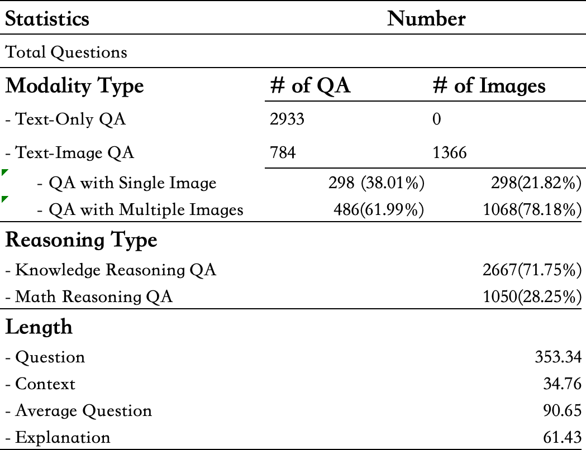
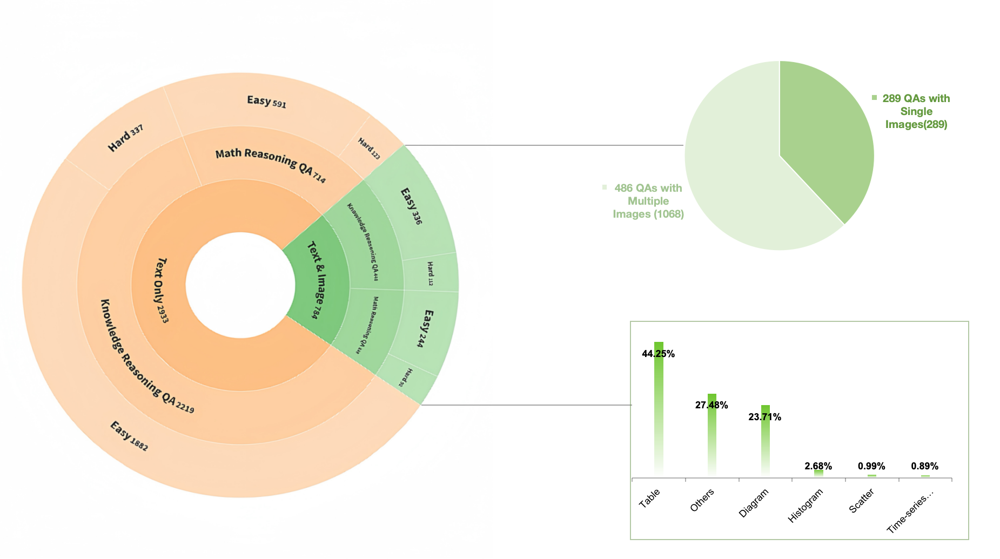
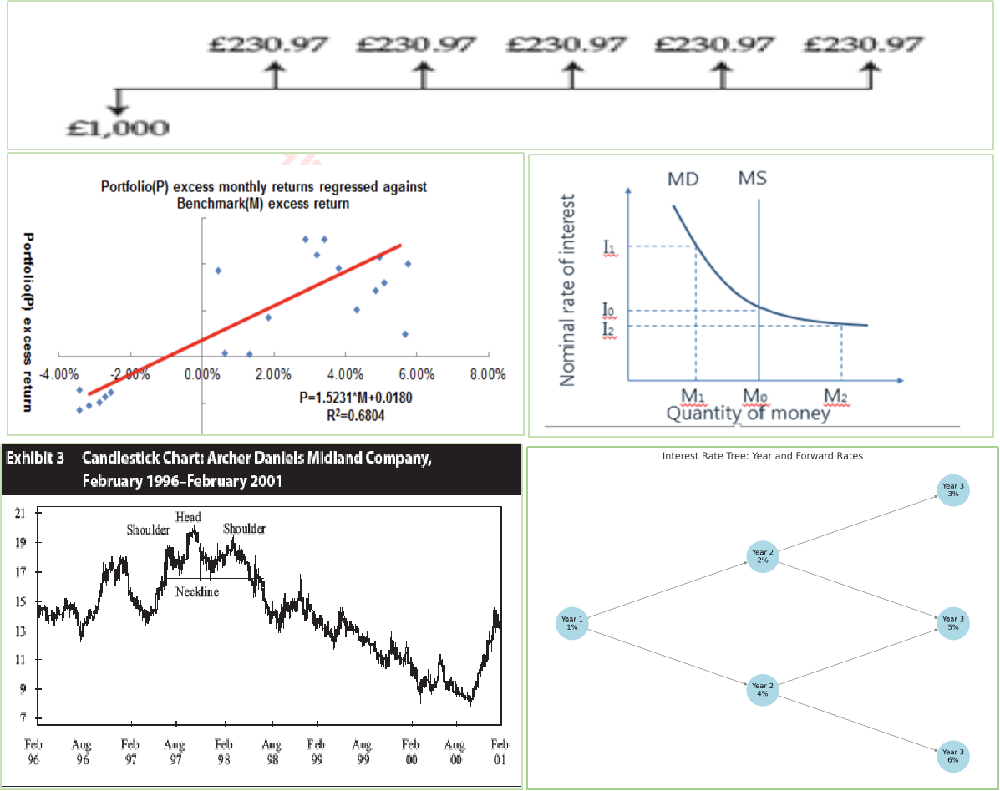
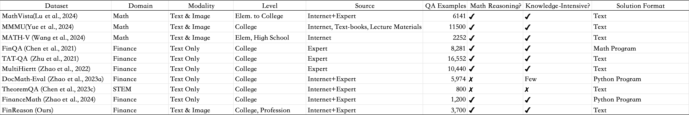

# A-Dataset

## Overview

In this section, we introduce the FinReason benchmark, a curated dataset designed to assess the multimodal financial reasoning capabilities of foundation models across various financial topics with visual contexts. We emphasize the challenges posed by the requirement for both expert-level visual perception and deliberate reasoning with financial knowledge. These challenges are exemplified in tasks that involve processing diverse types of heterogeneous images, requiring models to proficiently integrate domain-specific knowledge to thoroughly understand both textual and visual content and to reason effectively. This extends beyond basic visual recognition, demanding a sophisticated approach that combines advanced multimodal analysis with knowledge-intensive and mathematical reasoning. The proposed benchmark covers 24 topics, including financial risk management, quantitative methods, and valuation and risk models, as detailed in Table 1. The questions in our dataset were manually collected from two financial professional exam forums and public exam websites. The difficulty levels were determined based on question complexity and categorized by two Ph.D. students in finance. Easy questions typically involve a single knowledge topic or straightforward mathematical calculations, while hard questions span multiple knowledge areas (two or three topics) or involve complex mathematical computations. The FinReason benchmark consists of 3,717 QA pairs with explanations, split into 3,000 development samples and 717 test samples for quick evaluation. Additional details, including coverage, statistics, and image types, are provided in Table 2, and Figures 2 and 3.

Table 1

## Data Collection

In general, our benchmark collection consists of two components drawn from financial professional exams: the CFA and FRM exams. The collection process involves two main stages. In the first stage, we compiled a list of various financial exams at both the collegiate and professional levels. Through this process, we identified the Chartered Financial Analyst (CFA) and Financial Risk Management (FRM) certifications as being internationally recognized and highly regarded. It is widely acknowledged that CFA exam questions cover a broad range of financial topics, while FRM questions focus more deeply on risk management. The content of these exams not only serves as a critical knowledge base for professionals but also constitutes a significant part of the curriculum in many universities. Based on this, we selected all question-answer pairs from these two exams. On Chinese financial professional exam platforms ([webs](https://www.frm.cn/answer/)), over 10 CFA and 11 FRM certificate holders have published these questions and answers along with explanations. Additionally, candidates who have taken these exams often recall and share questions and answers on relevant [forums](https://bbs.frm.cn/), where they engage in discussions and provide detailed solutions. We collected these QA pairs from two main forums and websites. Since some questions were formatted as PDF files, we utilized the Mathpix API ([Wang et al., 2024](zotero://select/library/items/4TS6RFHG)) to extract text, mathematical formulas, and images. In the second stage, to ensure the accuracy of the dataset, we enlisted two PhD students majoring in Finance at the University of Auckland Business School, both of whom have taken the CFA and FRM exams. They verified the correctness of the explanations sourced from the forums. We filtered out QA pairs that lacked correct answers or high-quality explanations. These curated data serve as excellent study materials for exam candidates. Furthermore, we strictly adhere to copyright and licensing regulations, ensuring that data from sites prohibiting copying or commercial use are excluded. For consistency in dataset formatting, we extracted only the images present in the questions, excluding those from options and explanations. As a result, our final dataset comprises 3,717 high-quality question-answer pairs with detailed explanations.

## Data Quality Assurance

To enhance the quality of our dataset, we implemented a three-stage data curation process involving six annotators (four Master’s students and two Ph.D. students from the Computer Science and Finance departments, respectively). In the first stage, we extracted question text and images separately. Using GPT-4o (OpenAI, 2023b), we identified the QA type (knowledge-intensive or math reasoning) and assigned reference topics to each question. For instance, a complex question might encompass a combination of financial concepts such as hedging strategies, beta calculation, and futures contracts. Since Mathpix occasionally fails to extract images accurately or returns images in the wrong order, we verified the alignment of the question, images, options, answers, and explanations manually with the help of four annotators. We removed questions with blurry images, missing explanations, or non-English content. After cross-verification by the Master’s annotators, we retained 4,470 question-answer pairs with English explanations, of which 30% were math-focused financial QA and 70% were knowledge-intensive QA. In the second stage, two Ph.D. students reviewed the reasoning provided in the explanations for validity, completeness, and clarity. Some explanations were too brief and lacked necessary reasoning steps. These were refined and expanded to include detailed reasoning, while incorrect explanations were corrected. Additionally, grammar and expression issues were addressed to ensure high-quality QA pairs suitable for reasoning tasks. Explanations that relied on external tools, such as financial professional calculators, were removed. After this stage, the dataset was reduced to 3,717 high-quality QA pairs. In the final stage, we labeled each question with metadata, including question ID, source topics, question type, and other relevant attributes.

## Data Statistics

According to the financial notebooks, we categorize all QA pairs into 24 distinct topics. Table 1 provides a detailed breakdown of the topic-type distribution within the FinReason dataset. Additionally, Figure 1 offers an intuitive summary of the various QA types, while Table 2 presents more detailed records, including modality types. Text-image questions, for instance, may contain single or multiple images. The reasoning types in this dataset are classified into knowledge-intensive reasoning and math reasoning, both of which fall under complex reasoning rather than common-sense reasoning in the financial domain. As a multimodal dataset, some questions include multiple images within their context. Specifically, we have 239 questions with 239 images and 486 questions with a total of 1,068 images. A line chart in Figure 1 illustrates the distribution of different image types, while Figure 2 showcases diverse images in our dataset, including time-series stock prices, scatter plots, binomial tree diagrams, and more. We randomly split the dataset into two subsets: *development* and *test* ([Zhao et al., 2024](zotero://select/library/items/R3L3UWYG)). The *development* set contains 700 examples intended for model development and validation, while the *test* set comprises the remaining 3,000 examples and is designed for standard evaluation.

table 2

Figure 1

Figure 2

## Comparison with Existing Benchmark

We outline the differences between FinReason and eight other  reasoning benchmarks: MathVista ([Lu et al., 2024](zotero://select/library/items/JFCJN7ZN)), MMMU ([Yue et al., 2024](zotero://select/library/items/CRFR977L)), MATH-V ([Wang et al., 2024](zotero://select/library/items/4TS6RFHG)), FinQA ([Chen et al., 2022](zotero://select/library/items/Q6ZHWRV5)), TAT-QA ([Zhu et al., 2021](zotero://select/library/items/436BPGTN)), MultiHiertt ([Zhao et al., 2022](zotero://select/library/items/VCHGBC7A)), DocMath-Eval ([Zhao et al., 2024](zotero://select/library/items/I8LMGSXS)), and FinanceMath ([Zhao et al., 2024](zotero://select/library/items/R3L3UWYG)). Table 3 provides a detailed comparison of the main differences.

### Compare with Multimodal Dataset

Math Vista ([Lu et al., 2024](zotero://select/library/items/JFCJN7ZN)) is a consolidated mathematical reasoning benchmark in visual contexts, designed to support the development of Large Visual Language Models. It focuses on tasks such as math word problems (MWP), figure question answering (FQA), and visual question answering (VQA). Derived from 28 existing multimodal datasets—including 9 MathQA and 19 VQA datasets—it also introduces three new datasets (i.e., IQ Test, FunctionQA, PaperQA). All data is categorized into seven math reasoning types: *algebraic reasoning, arithmetic reasoning, geometry reasoning, logical reasoning, numeric common sense, scientific reasoning,* and *statistical reasoning.* However, these examples are not knowledge-intensive as they primarily target elementary and high school levels. In contrast, MMMU is designed to evaluate the multi-disciplinary multimodal understanding and reasoning capabilities of LLMs. It covers 30 subjects across six disciplines, including Finance, and targets a college-level audience. The dataset consists of 11,500 questions, divided into a few-shot development set, a validation set, and a test set. Although MATH-V is not a college-level dataset, it is derived from diverse competitions such as Math Kangaroo, UK \[Grey, Pink, Junior, Senior], ACM, and AIME. These examples require expert-level visual perception and deliberate reasoning across 16 subject-intensive knowledge areas. In contrast to Math Vista, MMMU, and MATH-V, our dataset uniquely includes knowledge-intensive and math reasoning QA pairs at both college and expert levels in the financial domain. It is specifically tailored to support the development of LLMs for financial question-answering tasks, featuring 3,717 examples from two professional exams (i.e., CFA and FRM). Additionally, we provide standard explanations for all QA pairs, with an average explanation length of 61.43 words, structured as rational steps to facilitate complex reasoning tasks in LLMs. Longer questions offer significant advantages, particularly in providing richer reasoning contexts ([Wang et al., 2024](zotero://select/library/items/4TS6RFHG)). Our dataset has an average question length of 90.65 words, which significantly exceeds the averages of Math Vista (15.6 words), MMMU (59.33 words), and MATH-V (42.3 words). Furthermore, we provide complementary contextual information specific to financial scenarios. Unlike other datasets, 486 questions in our dataset contain multiple images rather than a single image per question, as shown in Table 2 and Figure 1.

### Compare with Financial QA Dataset

As illustrated in Table 3, although existing financial question-answering benchmarks at the college level are available, they are primarily designed for Large Language Models (LLMs) rather than Large Visual Language Models (LVLMs), as they rely solely on text data as input. FinQA ([Chen et al., 2021](zotero://select/library/items/657PYVXL)) supports numerical reasoning over financial data, comprising 8,281 examples. This dataset is filtered from the FinTabNet dataset (Zheng et al., 2021), which is based on earnings reports of S\&P 500 companies from 1999 to 2019. While it requires financial and accounting knowledge, the questions generally involve only simple numerical calculations, as overly complex tables were excluded. Thus, from a professional perspective, it does not represent a complex reasoning task. Similarly, TAT-QA ([Zhu et al., 2021](zotero://select/library/items/Q8YAAQXE)) and MultiHiertt ([Zhao et al., 2022](zotero://select/library/items/VCHGBC7A)) are derived from real-world financial reports, consisting of 13,215 and 10,440 examples, respectively. These datasets focus on a specific subtopic within finance, namely financial accounting (or Financial Reporting and Analysis). In contrast to these three datasets, our benchmark includes not only table images (including complex tables) but also examples spanning 24 diverse financial topics. The mathematical reasoning tasks in our dataset are more intricate, often requiring advanced knowledge in mathematics and statistics, such as calculus. DocMath-Eval ([Zhao et al., 2024](zotero://select/library/items/N3SKMXCT)) and FinanceMath ([Zhao et al., 2024](zotero://select/library/items/R3L3UWYG)) both offer financial examples with Python-program-based solutions. The former, with 5,974 examples, emphasizes understanding lengthy and specialized documents, while the latter, with 1,200 examples, focuses on short questions without additional context, covering seven financial topics. In contrast, our dataset includes both math reasoning and knowledge-intensive financial reasoning questions. Additionally, all questions are annotated with detailed explanations across 24 distinct financial topics, providing a richer and more comprehensive resource for complex reasoning tasks in the financial domain.

Table 3

